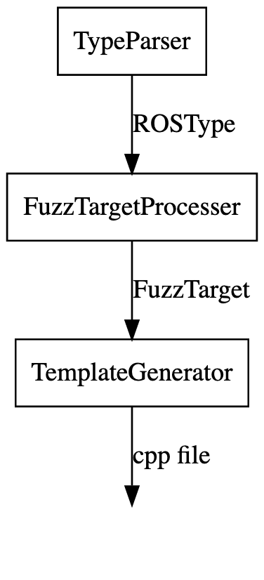

# Automatic fuzzing for ROS 2

<!--

[](https://GitHub.com/JnxF/automatic_fuzzing/stargazers/)
[](https://GitHub.com/JnxF/automatic_fuzzing/network/)
[](https://github.com/JnxF/automatic_fuzzing)
[](https://GitHub.com/JnxF/automatic_fuzzing/graphs/contributors/)
[](https://github.com/JnxF/automatic_fuzzing/blob/master/LICENSE)-->

An automatic fuzzing tool for ROS 2 C++ projects.

## Installation

TODO

```bash
pip install ros2_fuzzer
```

<!--
## Dependencies
[](https://dreampuf.github.io/GraphvizOnline/#digraph%20G%20%7B%0A%20%20node%20%5Bshape%3Dbox%5D%3B%0A%20%20TypeParser%20-%3E%20FuzzTargetProcesser%20%5Blabel%3D%22ROSType%22%5D%3B%0A%20%20FuzzTargetProcesser%20-%3E%20TemplateGenerator%20%5Blabel%3D%22FuzzTarget%22%5D%3B%0A%20%20TemplateGenerator%20-%3E%20%22%20%22%20%5Blabel%3D%22cpp%20file%22%5D%3B%0A%20%20%22%20%22%20%5Bshape%3Dnone%5D%3B%0A%7D)-->

## Usage

The tool comprises two different commands: `auto_detector` and `ros2_fuzzer`:

1. Navigate to your ROS working space.
2. Run `auto_detector`.
3. Fill the missing `TODO`s in the generated `fuzz.yaml` file accordingly.
4. Run `ros2_fuzzer` and follow the steps.

## CLIs

### `auto_detector`

TODO

```bash
usage: auto_detector [-h] [--path PATH] [-f] [-v]

Automatic C++ ROS 2 components finder

optional arguments:
  -h, --help       show this help message and exit
  --path PATH      path to search for ROS artifacts (default = the working
                   directory)
  -f, --overwrite  forces overwrite
  -v, --verbose    increase output verbosity
```

### `ros2_fuzzer`

TODO

```bash
usage: ros2_fuzzer [-h] [--path PATH] [-v]

ROS 2 automatic fuzzer

optional arguments:
  -h, --help     show this help message and exit
  --path PATH    Path where the fuzz.yaml file is located
  -v, --verbose  increase output verbosity
```

## License

[MIT](https://choosealicense.com/licenses/mit/)

## Acknowledgements

<a href="http://rosin-project.eu">
  
</a>

Supported by ROSIN - ROS-Industrial Quality-Assured Robot Software
Components. More information:
<a href="http://rosin-project.eu">rosin-project.eu</a>


This project has received funding from the European Union’s Horizon
2020 research and innovation programme under grant agreement no. 732287.
